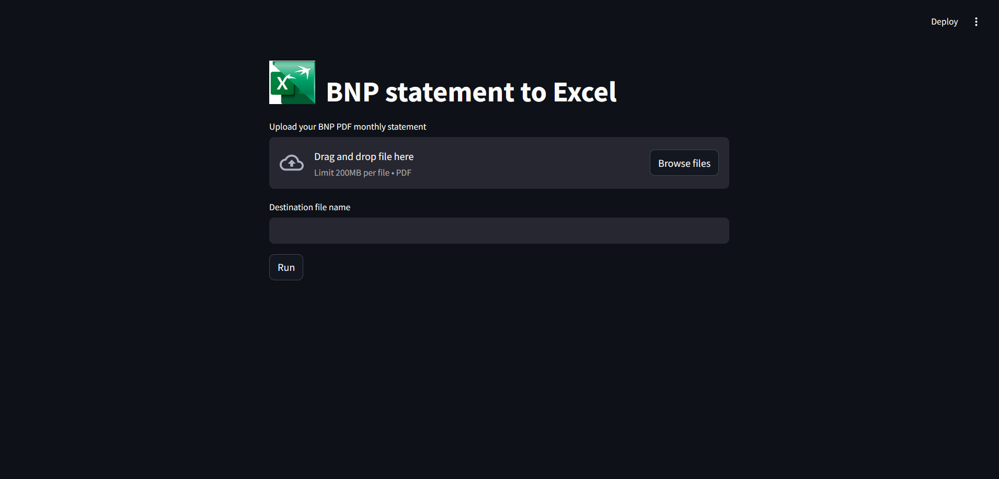
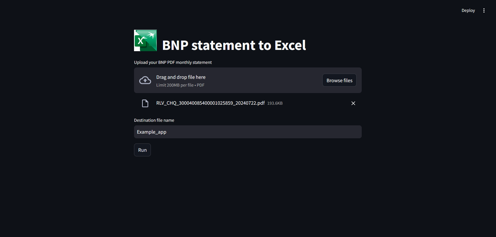
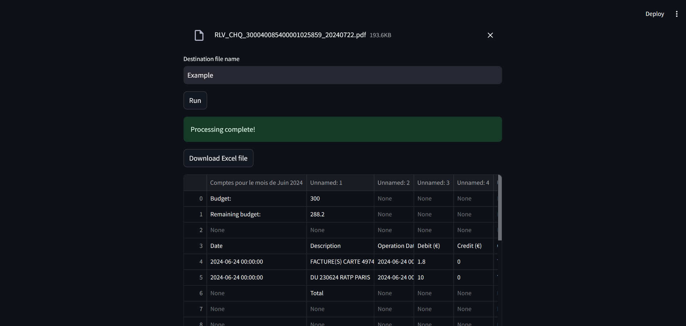
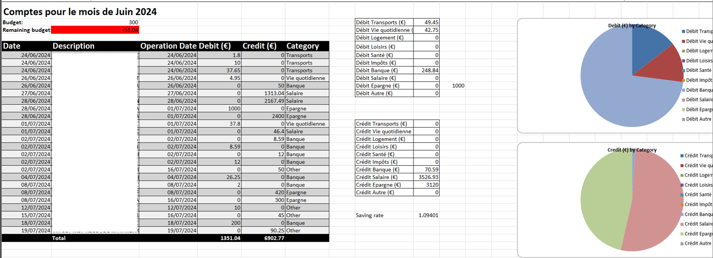

# PDF to Excel Converter with Streamlit

## Introduction and Project Presentation

This project is a Streamlit web application that allows users to transform a bank account report PDF into an Excel file. The generated Excel file includes some graphics and key metrics extracted from the report. This tool is useful for financial analysis and visualization of bank account statements.



## Installation

To get started with this project, you'll need to have Python and Streamlit installed on your machine. Follow these steps to set up the project:

1. Clone the repository:

```sh
git clone https://github.com/yourusername/pdf-to-excel-streamlit.git
cd pdf-to-excel-streamlit
```

2. Create a virtual environment and activate it

```sh
python -m venv venv
source venv/bin/activate  # On Windows, use `venv\Scripts\activate`
```

3. Install the required dependencies

```sh
pip install -r requirements.txt
```


## Usage

1. Streamlit

To run the Streamlit app, use the following command:
```sh
streamlit run BNP_to_Excel.py
```

This will start the Streamlit server, and you can interact with the app in your web browser. The app interface allows you to upload a PDF file and input a destination file name. When you click the "Run" button, the app processes the PDF and generates an Excel file.





Here is the final excel file obtained at the end of the processing:


A recording of the whole process is avaliable in the "Image" folder (Demo_app.mp4).


2. API

You can also use the app via its API. To do so, you can take inspiration from the code in "Example.ipynb".

- Modify the environment variables in the .env file: add an ID that will be used to name your files: "ACCOUNT8ID = <your_name>"

- Import the module via

```python
from src import *
```

- Create and add the operations from your pdf:

```python
statement = Monthly_Summary("My_pdf_file.pdf", verbose = True)

statement.add_operations()
```
> You can set many settings to adapt the processing to your needs, here is just presented a very basic example.

- Export it to .xlsx format 
```python
statement.to_excel("my_excel_file.xlsx")
```

## Code details

1. Streamlit App Code

2. Process Function

3. Example Output


## Contributing

Contributions are welcome! Please feel free to submit a Pull Request.

## License

This project is licensed under the GPL-3.0 License